# 🎯 Job Application Tracker


## 📌 Overview
 A full-stack web application that helps job seekers stay organized during their job search. Users can track applications, monitor statuses, record interview details, manage documents, and keep notes — all in one place. 
 
Built with **ASP.NET Core 10** REST API and **Angular 21** frontend, secured with **Microsoft Identity** authentication, designed with **Clean Architecture**, **CQRS**, **MediatR**, and **Repository Pattern**, backed by **SQL Server** database.

> 💡 *I built this because I was scattered across multiple files and folders — 
> saving CVs, resumes, and cover letters everywhere while trying to track 
> applications and interviews at the same time. I wanted one clean place for all of it, so I built it.*
 
 
 ## ✨ Features 
 ### 📋 Job Application Management
  - Add, edit, and delete job applications 
  -  Store company name, job title, location, job link, and application date
  -  View all saved applications in one dashboard 
 ### 📊 Status Tracking Track every application through its full lifecycle: 
 - 🔖 Saved→ 📩 Applied → 🎤 Interview → 🎉 Offer → ✅ Accepted | ❌ Rejected  

### 🎤 Interview Tracking
- Record interview date, type, and notes per application
- Add preparation materials before each interview
-  Record feedback and lessons learned after each interview

### 📝 Notes Management
-  **Application Notes** — attach notes to any job application (recruiter info, salary expectations, reminders)
-  **Personal Notes** — a personal space to store your own thoughts, goals, and job search strategy

 ### 📄 Documents Management - 
 -   Upload and save CVs, Resumes, and Cover Letters  
  -   Store preparation materials per interview 
 ### 📊 Dashboard & Statistics 
 -   Overview of all applications and their statuses - 
  -  Summary statistics: 
      -  Total applications 
      - Number of interviews 
     - Number of offers 
     - Number of rejections
  ### 🔐 Authentication & Security 
-    User registration and secure login with **Microsoft Identity**
-   **Email confirmation** for account verification
-    **Forgot password / password reset** via secure email links
-   Each user can only access their own data
-   Secure password hashing and storage


## 🛠️ Tech Stack

**Backend:**
- ASP.NET Core 10
- Entity Framework Core
- SQL Server
- Microsoft Identity (Authentication & Authorization)
- Clean Architecture
- MediatR 
- CQRS

**Frontend:**
- Angular 21
- TypeScript
- Bootstrap / Tailwind CSS

**Tools:**
- Git & GitHub
- Swagger (API Documentation)
- Visual Studio / VS Code
- Microsoft SQL Server Management Studio (SSMS)

  


## 🏗️ Architecture & Design Patterns 
The backend is built following 
**Clean Architecture** principles with a clear separation of concerns across layers:

```
backend/
├── API/                    # Controllers & HTTP layer
├── Application/            # Business logic
│   ├── Commands/           # Write operations (CQRS)
│   ├── Queries/            # Read operations (CQRS)
│   ├── Handlers/           # MediatR handlers
│   └── DTOs/               # Data Transfer Objects
├── Domain/                 # Core entities & interfaces
└── Infrastructure/         # EF Core, Repositories, Identity
    └── Repositories/       # Repository pattern implementation
```


### Patterns & Principles Used:
| Pattern | Purpose |
|---------|---------|
| **Clean Architecture** | Separation of concerns across layers |
| **CQRS** | Separate read and write operations |
| **MediatR** | Decoupled communication between layers |
| **Repository Pattern** | Abstraction over data access layer |

---


---

## 📸 Screenshots

### 🔐 Authentication
| Login | Register | Forgot Password |
|-------|----------|-----------------|
| 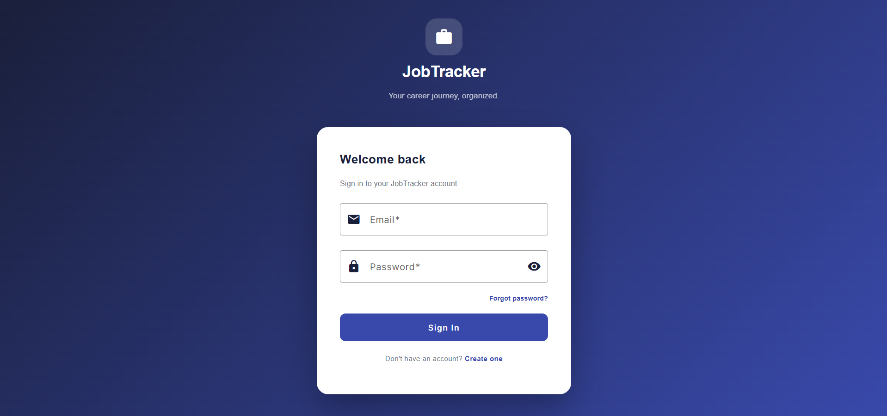 | 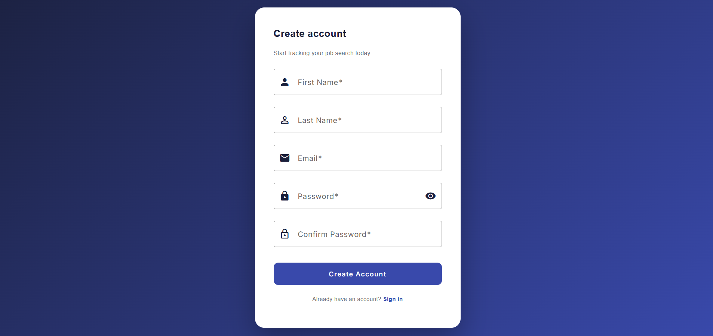 | 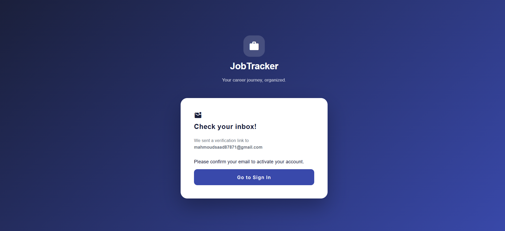 |

---

### 🏠 Dashboard
| Overview | Statistics |
|----------|------------|
| 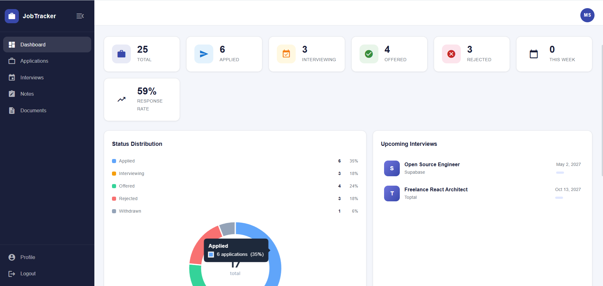 | 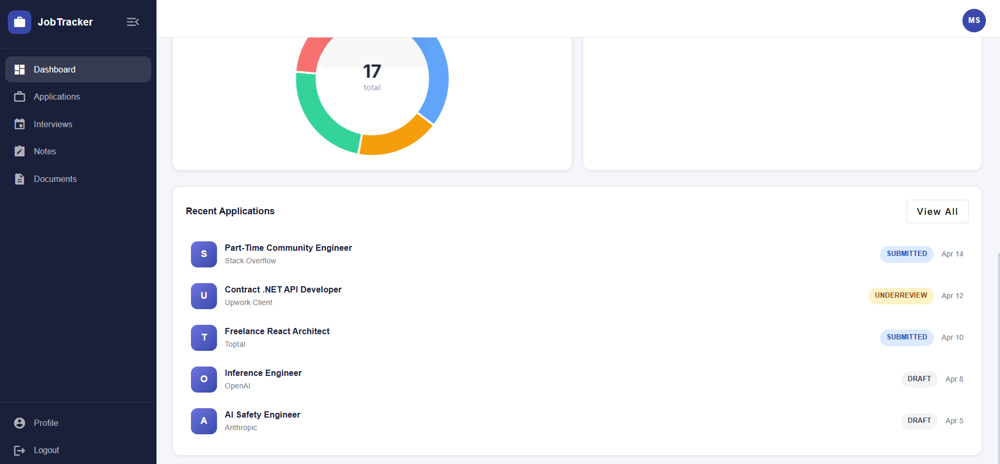 |

---

### 📄 Applications & Interviews
| Applications List | Application Detail | Interviews |
|-------------------|--------------------|------------|
| 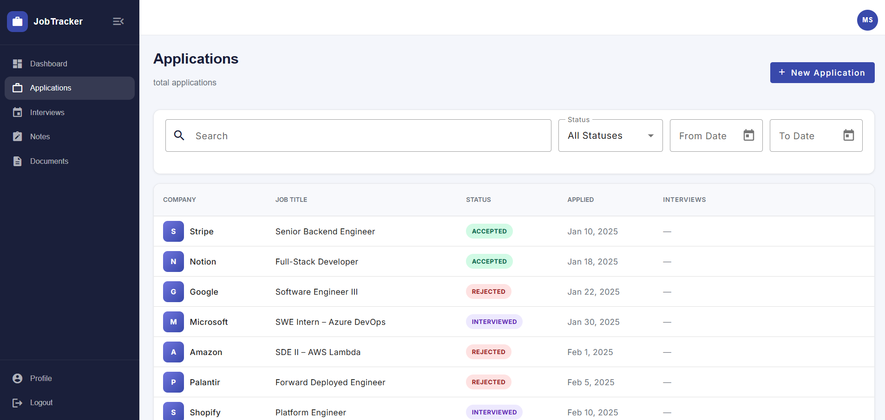 | 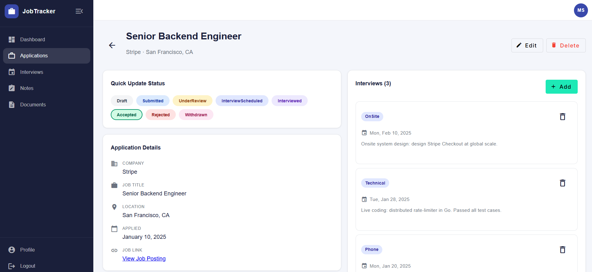 | 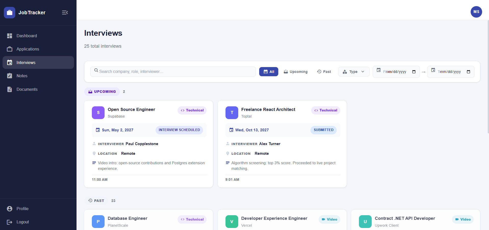 |

---

### 📝 Notes & Documents
| Notes | Documents | Profile |
|-------|-----------|---------|
| 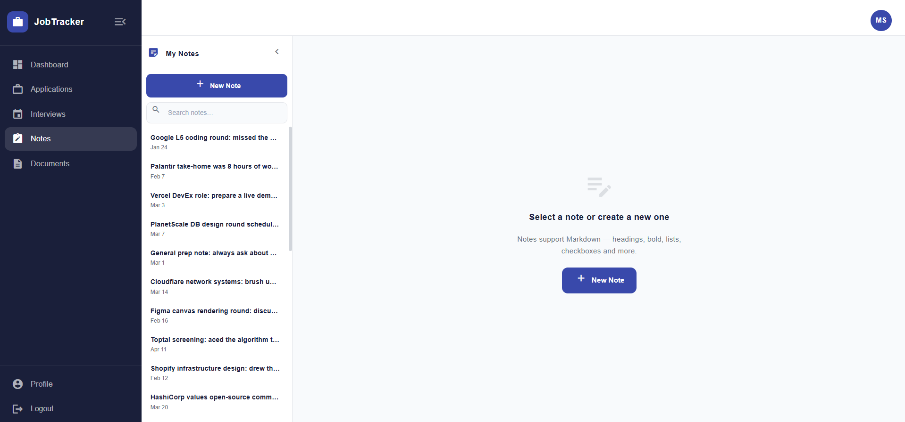 | 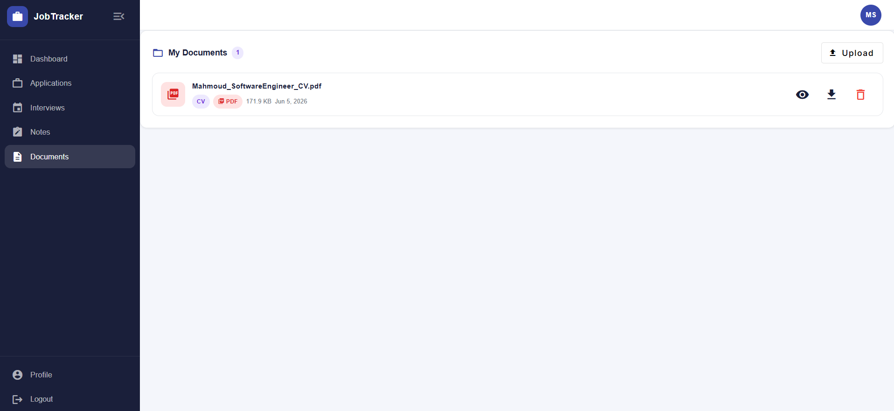 | 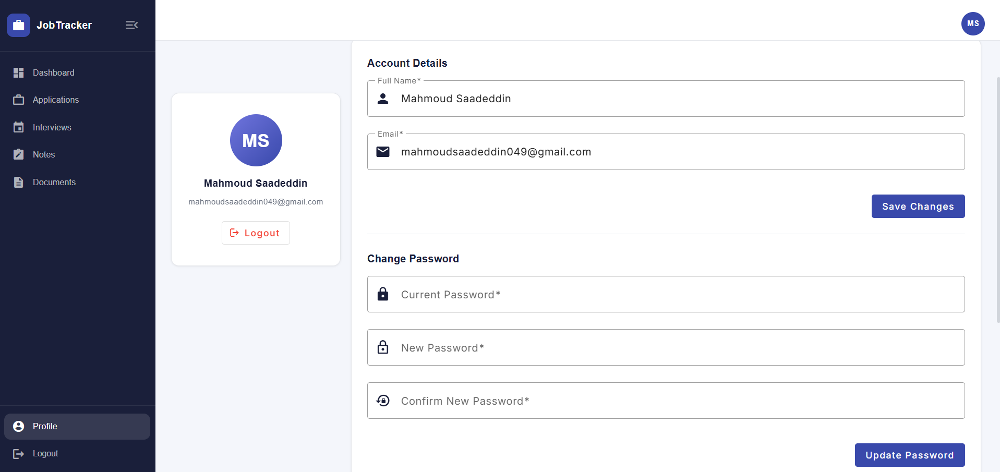 |

---

## 🚀 Getting Started

### Prerequisites
- [.NET 10 SDK](https://dotnet.microsoft.com/download)
- [Node.js](https://nodejs.org/)
- SQL Server

### Installation

```bash
# Clone the repo
git clone https://github.com/mahmoudsaad111/JobAppTracker.git

# Backend setup
cd backend
dotnet restore
dotnet ef database update
dotnet run

# Frontend setup
cd frontend
npm install
ng serve
```

> App runs on `https://localhost:4200` by default  
> API runs on `https://localhost:44315` by default  
> Swagger UI available at `http://localhost:44315/swagger`

---


## 📋 API Modules

| Module | Description |
|--------|-------------|
| `/api/auth` | Register, login, logout, Forgot Password |
| `/api/applications` | Manage job applications |
| `/api/notes` | Manage User Notes |
| `/api/documents` | Upload & manage documents |
| `/api/interviews` | Interview tracking & feedback |
| `/api/dashboard` | Statistics & overview |

> 📖 Full API documentation available at `/swagger` when running locally

---

## 📁 Project Structure
```
JobAppTracker/
├── backend/
│   ├── API/
│   ├── Application/
│   │   ├── Commands/
│   │   ├── Queries/
│   │   ├── Handlers/
│   │   └── DTOs/
│   ├── Domain/
│   └── Infrastructure/
│       └── Repositories/
│
└── frontend/
    └── src/
        ├── app/
        ├── components/
        └── services/
```   
---

## 🔮 Future Enhancements
- 🔔 Interview reminders & notifications
- 📊 Advanced job search analytics
- 🤖 AI-assisted job search tools
- 🧩 Browser extension for quick application adding

---

## 👤 Author
**Mahmoud**
- GitHub: [@mahmoudsaad111](https://github.com/mahmoudsaad111)
- LinkedIn: [mahmoud-saadeddin-13a9981b4](https://www.linkedin.com/in/mahmoud-saadeddin-13a9981b4)

## 📄 License
This project is licensed under the MIT License.
